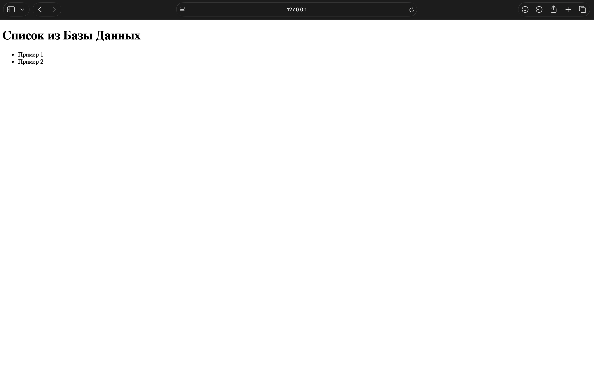

# Лабораторная работа: Docker и Docker Compose

## Цель работы

Изучить основы контейнеризации приложений с использованием Docker и Docker Compose, научиться создавать Docker-образы, запускать контейнеры и организовывать взаимодействие web-приложения с базой данных MySQL.

Репозиторий: https://github.com/labubutrue/lab_docker

Задание: https://github.com/tp-lessons/lab_docker

---

# Homework

В репозитории приведён код web-приложения, которое получает данные из базы данных MySQL.

## Часть I. Docker

### 1. Добавьте в код Dockerfile, который позволит запустить web-приложение с исходным кодом в каталоге `app/` через docker.

Создан `Dockerfile`:

### Команда

```bash
cat > Dockerfile <<'EOF'
FROM python:3.12-slim

WORKDIR /app

COPY app/requirements.txt .

RUN pip install --no-cache-dir -r requirements.txt

COPY app/ .

EXPOSE 5000

CMD ["python", "app.py"]
EOF
```

Docker-образ собран из созданного `Dockerfile`.

### Команда

```bash
docker build -t lab-docker-app .
```

### Вывод

<details>
<summary>Показать полный вывод</summary>

```text
DEPRECATED: The legacy builder is deprecated and will be removed in a future release.

            Install the buildx component to build images with BuildKit:

            https://docs.docker.com/go/buildx/

Sending build context to Docker daemon  12.29kB

Step 1/7 : FROM python:3.12-slim

3.12-slim: Pulling from library/python

3550292b2150: Pulling fs layer

bf7af0229701: Pulling fs layer

ab2cb3ee67af: Pulling fs layer

8aff2d3a9af8: Pulling fs layer

f392c22314d9: Download complete

d8d4cdf3552b: Download complete

3550292b2150: Download complete

ab2cb3ee67af: Download complete

8aff2d3a9af8: Download complete

bf7af0229701: Download complete

bf7af0229701: Pull complete

ab2cb3ee67af: Pull complete

8aff2d3a9af8: Pull complete

3550292b2150: Pull complete

Digest: sha256:78387bc3881b8273120a12ebe6c1ab22b018ccc2c9adf565ae1ac9b536e184ea

Status: Downloaded newer image for python:3.12-slim

 ---> 78387bc3881b

Step 2/7 : WORKDIR /app

 ---> Running in 3713f23f8202

 ---> Removed intermediate container 3713f23f8202

 ---> 78d2c3fe8d40

Step 3/7 : COPY app/requirements.txt .

 ---> 6454c49cd195

Step 4/7 : RUN pip install --no-cache-dir -r requirements.txt

 ---> Running in 13bc6b640a13

Collecting flask (from -r requirements.txt (line 1))

  Downloading flask-3.1.3-py3-none-any.whl.metadata (3.2 kB)

Collecting mysql-connector-python (from -r requirements.txt (line 2))

  Downloading mysql_connector_python-26.7.0-cp312-cp312-manylinux_2_28_aarch64.whl.metadata (11 kB)

Collecting blinker>=1.9.0 (from flask->-r requirements.txt (line 1))

  Downloading blinker-1.9.0-py3-none-any.whl.metadata (1.6 kB)

Collecting click>=8.1.3 (from flask->-r requirements.txt (line 1))

  Downloading click-8.5.0-py3-none-any.whl.metadata (2.6 kB)

Collecting itsdangerous>=2.2.0 (from flask->-r requirements.txt (line 1))

  Downloading itsdangerous-2.2.0-py3-none-any.whl.metadata (1.9 kB)

Collecting jinja2>=3.1.2 (from flask->-r requirements.txt (line 1))

  Downloading jinja2-3.1.6-py3-none-any.whl.metadata (2.9 kB)

Collecting markupsafe>=2.1.1 (from flask->-r requirements.txt (line 1))

  Downloading markupsafe-3.0.3-cp312-cp312-manylinux2014_aarch64.manylinux_2_17_aarch64.manylinux_2_28_aarch64.whl.metadata (2.7 kB)

Collecting werkzeug>=3.1.0 (from flask->-r requirements.txt (line 1))

  Downloading werkzeug-3.1.8-py3-none-any.whl.metadata (4.0 kB)

Downloading flask-3.1.3-py3-none-any.whl (103 kB)

Downloading mysql_connector_python-26.7.0-cp312-cp312-manylinux_2_28_aarch64.whl (22.0 MB)

   ━━━━━━━━━━━━━━━━━━━━━━━━━━━━━━━━━━━━━━━━ 22.0/22.0 MB 2.4 MB/s eta 0:00:00

Downloading blinker-1.9.0-py3-none-any.whl (8.5 kB)

Downloading click-8.5.0-py3-none-any.whl (125 kB)

Downloading itsdangerous-2.2.0-py3-none-any.whl (16 kB)

Downloading jinja2-3.1.6-py3-none-any.whl (134 kB)

Downloading markupsafe-3.0.3-cp312-cp312-manylinux2014_aarch64.manylinux_2_17_aarch64.manylinux_2_28_aarch64.whl (24 kB)

Downloading werkzeug-3.1.8-py3-none-any.whl (226 kB)

Installing collected packages: mysql-connector-python, markupsafe, itsdangerous, click, blinker, werkzeug, jinja2, flask

Successfully installed blinker-1.9.0 click-8.5.0 flask-3.1.3 itsdangerous-2.2.0 jinja2-3.1.6 markupsafe-3.0.3 mysql-connector-python-26.7.0 werkzeug-3.1.8

WARNING: Running pip as the 'root' user can result in broken permissions and conflicting behaviour with the system package manager, possibly rendering your system unusable. It is recommended to use a virtual environment instead: https://pip.pypa.io/warnings/venv. Use the --root-user-action option if you know what you are doing and want to suppress this warning.

[notice] A new release of pip is available: 25.0.1 -> 26.2.1

[notice] To update, run: pip install --upgrade pip

 ---> Removed intermediate container 13bc6b640a13

 ---> 7748238f9ee9

Step 5/7 : COPY app/ .

 ---> b91805d8e67a

Step 6/7 : EXPOSE 5000

 ---> Running in ec786b9ebcc5

 ---> Removed intermediate container ec786b9ebcc5

 ---> 596d5b5f77c7

Step 7/7 : CMD ["python", "app.py"]

 ---> Running in 4efc9a493485

 ---> Removed intermediate container 4efc9a493485

 ---> 4035f8532e94

Successfully built 4035f8532e94

Successfully tagged lab-docker-app:latest
```

</details>

---

### 2. Выполните запуск контейнера с этим приложением.

### Команда

```bash
docker run -d -p 5000:5000 --name lab_docker_app lab-docker-app
```

### Вывод

```text
2c00a77494419c5f8011b309b245bc63cf6f3f9b7128a8a3bc2d50c9bcddbca7
```

Проверено, что контейнер запущен.

### Команда

```bash
docker ps
```

### Вывод

```text
CONTAINER ID   IMAGE            COMMAND           CREATED         STATUS         PORTS                                         NAMES
2c00a7749441   lab-docker-app   "python app.py"   5 seconds ago   Up 4 seconds   0.0.0.0:5000->5000/tcp, [::]:5000->5000/tcp   lab_docker_app
```

---

### 3. Скопируйте из консоли в каталог `/home/` контейнера файл `README.md`.

### Команда

```bash
docker cp README.md lab_docker_app:/home/README.md
```

### Вывод

```text
Successfully copied 4.44kB (transferred 6.14kB) to lab_docker_app:/home/README.md
```

---

### 4. Подключитесь к терминалу контейнера с приложением в интерактивном режиме. Проверьте, что скопированный файл находится в нужном каталоге.

### Команда

```bash
docker exec -it lab_docker_app sh
```

В интерактивном терминале контейнера проверено содержимое каталога `/home`.

### Команда

```bash
ls -l /home
```

### Вывод

```text
total 8
-rw-r--r-- 1 501 dialout 4442 Sep  3 08:48 README.md
```

Дополнительно содержимое скопированного файла было прочитано из контейнера.

### Команда

```bash
cat /home/README.md
```

### Вывод

<details>
<summary>Показать полный вывод README.md</summary>

````text
## Лабораторная работа по работе с docker

Работа посвящена изучению технологии работы с контейнерами

## Задачи

\- [ ] 1. Ознакомиться со ссылками учебного материала

\- [ ] 2. Выполнить инструкцию учебного материала

\- [ ] 3. Составить отчет и отправить ссылку преподавателю

## Задание лабораторной работы

```bash

$ export GITHUB_USERNAME=<имя_пользователя>

$ export GIST_TOKEN=<сохраненный_токен>

$ alias edit=<nano|vi|vim|subl>

```

```sh

$ git clone https://github.com/${GITHUB_USERNAME}/lab06 projects/lab_docker

$ cd projects/lab_docker

$ git remote remove origin

$ git remote add origin https://github.com/${GITHUB_USERNAME}/lab_docker

```

```sh

# Debian

$ sudo apt-get update

$ sudo apt install docker-ce docker-ce-cli containerd.io docker-buildx-plugin docker-compose-plugin

```

```sh

$ cat >> main.py <<EOF

print("Hello, Docker!")

EOF

```

```sh

$ cat >> requirements.txt <<EOF

flask

requests

EOF

```

```sh

$ cat >> Dockerfile <<EOF

FROM python:3.9-slim

WORKDIR /app

RUN apt-get update && apt-get install -y \\

    build-essential

COPY requirements.txt .

RUN pip install --no-cache-dir -r requirements.txt

COPY . .

CMD ["python", "main.py"]

EOF

```

```sh

$ docker build -t lab-docker .

$ docker run --rm -it lab-docker

```

### Docker compose

```sh

$ cat >> docker-compose.yml <<EOF

version: '3.8'

services:

  app:

    build: .

    container_name: lab_docker

    depends_on:

      db:

        condition: service_healthy

    environment:

      - DB_HOST=$DB_HOST

      - DB_USER=$DB_USER

      - DB_PASSWORD=$DB_PASSWORD

      - DB_NAME=$DB_NAME

  # Сервис базы данных MySQL

  db:

    image: mysql:8.0

    container_name: mysql_db

    restart: always

    environment:

      MYSQL_ROOT_PASSWORD: $DB_ROOT_PASSWORD

      MYSQL_DATABASE: $DB_NAME

      MYSQL_USER: $DB_USER

      MYSQL_PASSWORD: $DB_PASSWORD

    ports:

      - "3306:3306"

    volumes:

      - db_data:/var/lib/mysql

    healthcheck:

      test: ["CMD", "mysqladmin", "ping", "-h", "localhost"]

      interval: 10s

      timeout: 5s

      retries: 5

volumes:

  db_data:

EOF

```

```sh

$ docker compose up --build

```

## Ссылки

### Docker compose

\- [Install the Docker Compose plugin](https://docs.docker.com/compose/install/linux/)

### Dockerfile

\- [Как запаковать простое приложение в Docker: на пальцах](https://habr.com/ru/companies/slurm/articles/930822/)

## Домашнее задание

В репозитории приведен код web-приложения, которое сохраняет в БД введенную информацию о задаче - ее имя.

## Часть I. Docker

1\. Добавьте в код Dockerfile, который позволит запустить web-приложение с исходным кодом в каталоге app/ через docker.

2\. Выполните запуск контейнера с этим приложением.

3\. Скопируйте из консоли в каталог /home/ контейнера файл README.md.

4\. Подключитесь к терминалу контейнера с приложением в интерактивном режиме. Проверьте, что скопированный файл находится в нужном каталоге.

5\. Выйдите из интерактивного режима.

6\. Остановите контейнер с приложением.


## Часть II. Docker compose

1\. Создайте файл docker-compose.yml таким образом, чтобы совместно с описанным в части 1 контейнером работала бы база данных mysql. Файл инициализации БД в каталоге db/init.sql. Также пропишите порт подключения к приложению. Например 5000.

2\. Запустите связку web-приложение - БД.

3\. Проверьте подключение к приложению через браузер. Сделайте снимок экрана.

4\. Проверьте работу приложения через браузер.
````

</details>

---

### 5. Выйдите из интерактивного режима.

### Команда

```bash
exit
```

---

### 6. Остановите контейнер с приложением.

### Команда

```bash
docker stop lab_docker_app
```

### Вывод

```text
lab_docker_app
```

Проверено, что после остановки запущенных контейнеров нет.

### Команда

```bash
docker ps
```

### Вывод

```text
CONTAINER ID   IMAGE     COMMAND   CREATED   STATUS    PORTS     NAMES
```

---

# Часть II. Docker Compose

### 1. Создайте файл `docker-compose.yml` таким образом, чтобы совместно с описанным в части 1 контейнером работала бы база данных MySQL. Файл инициализации БД находится в каталоге `db/init.sql`. Также пропишите порт подключения к приложению. Например 5000.

Создан `docker-compose.yml`, описывающий два сервиса:

- `app` — Flask-приложение из части I;
- `db` — MySQL 8.0.

Приложение подключается к базе данных по имени сервиса `db`. Запуск приложения зависит от успешного healthcheck базы данных. Файл `db/init.sql` подключён к стандартному каталогу инициализации MySQL.

Изначально использовался внешний порт `5000`, однако на macOS этот порт был занят системным процессом. Поэтому внешний порт приложения был изменён на `5001`, а внутренний порт контейнера остался `5000`.

### Команда

```bash
python3 - <<'PY'
from pathlib import Path

p = Path("docker-compose.yml")
s = p.read_text()
s = s.replace('"5000:5000"', '"5001:5000"')
p.write_text(s)
PY
```

Финальный `docker-compose.yml`:

```yaml
services:
  app:
    build:
      context: .
      dockerfile: Dockerfile
    container_name: lab_docker_app
    ports:
      - "5001:5000"
    environment:
      DB_HOST: db
      DB_USER: labuser
      DB_PASS: labpass
      DB_NAME: labdb
    depends_on:
      db:
        condition: service_healthy

  db:
    image: mysql:8.0
    container_name: lab_docker_db
    environment:
      MYSQL_ROOT_PASSWORD: rootpass
      MYSQL_DATABASE: labdb
      MYSQL_USER: labuser
      MYSQL_PASSWORD: labpass
    volumes:
      - db_data:/var/lib/mysql
      - ./db/init.sql:/docker-entrypoint-initdb.d/init.sql:ro
    healthcheck:
      test: ["CMD-SHELL", "mysqladmin ping -h localhost -uroot -p$$MYSQL_ROOT_PASSWORD --silent"]
      interval: 5s
      timeout: 5s
      retries: 20
      start_period: 10s

volumes:
  db_data:
```

Для корректной работы с кириллицей файл инициализации БД приведён к UTF-8:

```sql
SET NAMES utf8mb4;

CREATE TABLE items (
    id INT AUTO_INCREMENT PRIMARY KEY,
    name VARCHAR(255) NOT NULL
) CHARACTER SET utf8mb4 COLLATE utf8mb4_unicode_ci;

INSERT INTO items (name)
VALUES ('Пример 1'), ('Пример 2');
```

---

### 2. Запустите связку web-приложение — БД.

Перед финальным запуском удалён предыдущий volume базы данных, чтобы `db/init.sql` выполнился при чистой инициализации MySQL.

### Команда

```bash
docker-compose down -v
```

### Вывод

```text
[+] down 4/4
 ✔ Container lab_docker_app    Removed
 ✔ Container lab_docker_db     Removed
 ✔ Network lab_docker_default  Removed
 ✔ Volume lab_docker_db_data   Removed
```

Связка из двух контейнеров запущена.

### Команда

```bash
docker-compose up --build -d
```

### Вывод

<details>
<summary>Показать полный вывод</summary>

```text
WARN[0000] Docker Compose requires buildx plugin to be installed

Sending build context to Docker daemon  2.558kB

Step 1/8 : FROM python:3.12-slim

 ---> 78387bc3881b

Step 2/8 : WORKDIR /app

 ---> Using cache

 ---> 78d2c3fe8d40

Step 3/8 : COPY app/requirements.txt .

 ---> Using cache

 ---> 6454c49cd195

Step 4/8 : RUN pip install --no-cache-dir -r requirements.txt

 ---> Using cache

 ---> 7748238f9ee9

Step 5/8 : COPY app/ .

 ---> Using cache

 ---> e2cfb2d48cb5

Step 6/8 : EXPOSE 5000

 ---> Using cache

 ---> 4e21e98764d3

Step 7/8 : CMD ["python", "app.py"]

 ---> Using cache

 ---> e581e3984b51

Step 8/8 : LABEL com.docker.compose.image.builder=classic

 ---> Using cache

 ---> 16197dee3594

Successfully built 16197dee3594

Successfully tagged lab_docker-app:latest

[+] up 5/5

 ✔ Image lab_docker-app       Built                                                                0.0s

 ✔ Network lab_docker_default Created                                                              0.0s

 ✔ Volume lab_docker_db_data  Created                                                              0.0s

 ✔ Container lab_docker_db    Healthy                                                             10.6s

 ✔ Container lab_docker_app   Started                                                             10.7s
```

</details>

Проверено состояние сервисов.

### Команда

```bash
docker-compose ps
```

### Вывод

```text
NAME             IMAGE            COMMAND                  SERVICE   CREATED         STATUS                   PORTS
lab_docker_app   lab_docker-app   "python app.py"          app       5 minutes ago   Up 5 minutes             0.0.0.0:5001->5000/tcp, [::]:5001->5000/tcp
lab_docker_db    mysql:8.0        "docker-entrypoint.s…"   db        5 minutes ago   Up 5 minutes (healthy)   3306/tcp, 33060/tcp
```

Таким образом, одновременно работают **два контейнера**: контейнер web-приложения и контейнер MySQL.

Для проверки взаимодействия контейнеров модель приложения была вызвана непосредственно внутри контейнера `app`.

### Команда

```bash
docker-compose exec -T app python - <<'PY'
from models import ItemModel

items = ItemModel().get_all_items()
print(repr(items))
PY
```

### Вывод

```text
[{'name': 'Пример 1'}, {'name': 'Пример 2'}]
```

Полученные значения находятся в MySQL и читаются кодом `ItemModel` из контейнера приложения. Это подтверждает взаимодействие `app -> db` через сеть Docker Compose.

---

### 3. Проверьте подключение к приложению через браузер. Сделайте снимок экрана.

Приложение доступно на хосте по адресу:

```text
http://127.0.0.1:5001/
```

Перед проверкой в браузере HTTP-ответ приложения также проверен из терминала.

### Команда

```bash
curl -i http://127.0.0.1:5001/
```

### Вывод

```text
HTTP/1.1 200 OK
Server: Werkzeug/3.1.8 Python/3.12.14
Date: Thu, 03 Sep 2026 09:59:07 GMT
Content-Type: text/html; charset=utf-8
Content-Length: 295
Connection: close

<!DOCTYPE html>
<html lang="ru">
<head>
    <meta charset="UTF-8">
    <title>MVC App</title>
</head>
<body>
    <h1>Список из Базы Данных</h1>
    <ul>
            <li>Пример 1</li>
            <li>Пример 2</li>
    </ul>
</body>
</html>
```

Снимок экрана браузера:



---

### 4. Проверьте работу приложения через браузер.

В браузере отображается web-страница приложения со значениями:

```text
Список из Базы Данных

Пример 1
Пример 2
```

Эти значения получаются приложением из таблицы `items` базы данных MySQL. Таким образом, итоговая схема взаимодействия имеет вид:

```text
браузер
   |
   v
Flask-приложение (lab_docker_app)
   |
   | DB_HOST=db
   v
MySQL (lab_docker_db)
   |
   v
таблица items
```

Контейнер базы данных находится в состоянии `healthy`, приложение получает данные из базы и возвращает их пользователю в HTTP-ответе.

---

# Сохранение результата в Git

Изменения сохранены в репозитории.

### Команда

```bash
git commit -m "Add Docker and Compose setup"
```

### Вывод

```text
[main 1a4cd74] Add Docker and Compose setup
 6 files changed, 68 insertions(+), 3 deletions(-)
 create mode 100644 .dockerignore
 create mode 100644 .gitignore
 create mode 100644 Dockerfile
 create mode 100644 docker-compose.yml
```

### Команда

```bash
git push -u origin main
```

### Вывод

<details>
<summary>Показать полный вывод</summary>

```text
Enumerating objects: 27, done.

Counting objects: 100% (27/27), done.

Delta compression using up to 10 threads

Compressing objects: 100% (20/20), done.

Writing objects: 100% (27/27), 6.39 KiB | 6.39 MiB/s, done.

Total 27 (delta 4), reused 13 (delta 1), pack-reused 0

remote: Resolving deltas: 100% (4/4), done.

To https://github.com/labubutrue/lab_docker.git

 * [new branch]      main -> main

branch 'main' set up to track 'origin/main'.
```

</details>

Финальное состояние рабочего дерева:

### Команда

```bash
git status
```

### Вывод

```text
On branch main

Your branch is up to date with 'origin/main'.

nothing to commit, working tree clean
```

---

# Результат

В ходе лабораторной работы:

1. Создан Dockerfile для web-приложения из каталога `app/`.
2. Docker-образ успешно собран, контейнер приложения запущен.
3. `README.md` скопирован в `/home/` контейнера и проверен из интерактивного терминала.
4. Контейнер приложения остановлен.
5. Создан `docker-compose.yml` с двумя сервисами: Flask-приложением и MySQL.
6. База данных инициализируется файлом `db/init.sql`.
7. Оба контейнера успешно работают одновременно, MySQL проходит healthcheck.
8. Проверено реальное взаимодействие контейнеров: модель приложения получает из MySQL значения `Пример 1` и `Пример 2`.
9. Приложение доступно через HTTP и отображает полученные из базы данные в браузере.
